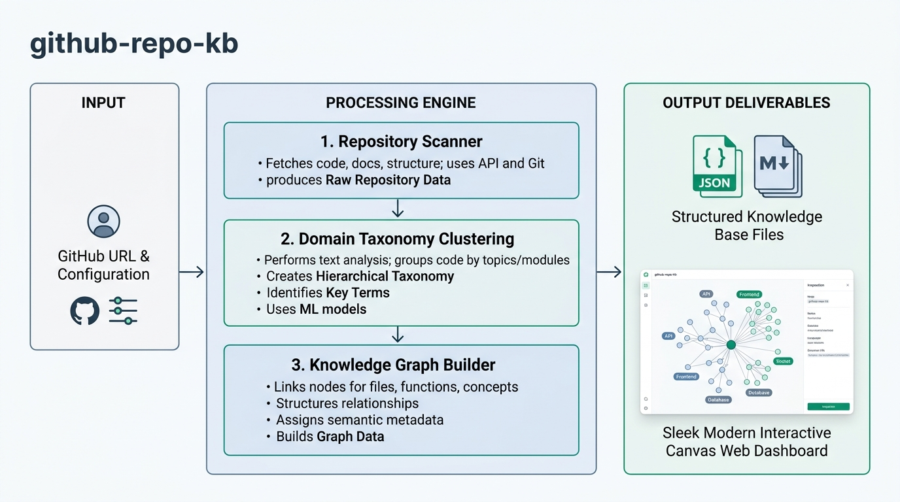

# GitHub Repository Knowledge Base Dashboard

An agent skill and Python engine that analyzes GitHub organizations, user profiles, or repository collections to generate a thematic domain knowledge base, architecture knowledge graph, an interactive HTML5 Canvas UI dashboard, and conversational repository search.

---

## Table of Contents

- [Overview](#overview)
- [Architecture and Workflow](#architecture-and-workflow)
- [Project Structure and File Tree](#project-structure-and-file-tree)
- [Thematic Domain Clustering](#thematic-domain-clustering)
- [Non-Technical User Guide: How to Use This Skill](#non-technical-user-guide-how-to-use-this-skill)
  - [What This Skill Does in Plain Terms](#what-this-skill-does-in-plain-terms)
  - [Core Concepts Explained](#core-concepts-explained)
  - [Step-by-Step Instructions](#step-by-step-instructions)
  - [Scanning Private Organizations or Restricted Repositories with a Token (PAT)](#scanning-private-organizations-or-restricted-repositories-with-a-token-pat)
  - [Real-World Usage Scenarios and Example Prompts](#real-world-usage-scenarios-and-example-prompts)
  - [Asking Questions and Searching for Programs in Chat](#asking-questions-and-searching-for-programs-in-chat)
  - [How to Interact with the Visual Canvas Dashboard](#how-to-interact-with-the-visual-canvas-dashboard)
  - [Troubleshooting Common Situations](#troubleshooting-common-situations)
- [Canvas UI Integration and Architecture](#canvas-ui-integration-and-architecture)
- [Key Features](#key-features)
- [Requirements](#requirements)
- [Configuration Guide](#configuration-guide)
- [Running the Python Code Directly](#running-the-python-code-directly)
  - [1. Quick Start with Offline Synthetic Data](#1-quick-start-with-offline-synthetic-data)
  - [2. Scanning a Live Public GitHub Organization or User](#2-scanning-a-live-public-github-organization-or-user)
  - [3. Scanning Private Organizations, Enterprise Accounts, and Restricted Repositories with a PAT](#3-scanning-private-organizations-enterprise-accounts-and-restricted-repositories-with-a-pat)
  - [4. Querying the Knowledge Base via CLI](#4-querying-the-knowledge-base-via-cli)
  - [5. Scanning a Single Repository](#5-scanning-a-single-repository)
  - [6. CLI Reference](#6-cli-reference)
  - [7. Running Automated Tests](#7-running-automated-tests)
- [Architecture and Data Model](#architecture-and-data-model)
  - [Thematic Domain Taxonomy](#thematic-domain-taxonomy)
  - [Knowledge Graph Schema](#knowledge-graph-schema)
  - [Centrality and Hub Classification](#centrality-and-hub-classification)
- [Interactive Canvas UI Elements](#interactive-canvas-ui-elements)
- [Security and Synthetic Data Compliance](#security-and-synthetic-data-compliance)
- [License](#license)

---

## Overview

Modern software organizations often maintain dozens or hundreds of repositories spanning clinical health apps, genomics workflows, billing systems, authentication servers, SDKs, and infrastructure. Navigating and understanding the thematic landscape across these codebases is challenging.

The `github-repo-kb` skill automates the entire ingestion, analysis, and visualization process:
1. Ingests metadata from live GitHub accounts (public organizations, private enterprise organizations, user profiles, single repos) or offline synthetic datasets.
2. Classifies repositories into logical **thematic domain clusters** (e.g. Medical & Healthcare, Life Sciences & Bioinformatics, Finance & Billing, Security & Identity, AI/ML, Developer Tooling, Infrastructure, Utilities) based on project purpose and subject matter rather than technical frameworks.
3. Constructs an architectural knowledge graph mapping intra-cluster and cross-cluster relationships (dependencies, integrations, client SDKs, shared infrastructure).
4. Provides semantic repository search so users can ask questions in natural language and find the best-suited repository for any capability.
5. Generates structured documentation (`KNOWLEDGE_BASE.md`, `knowledge_base.json`, `knowledge_graph.json`) and a standalone interactive Canvas UI dashboard (`dashboard.html`).

---

## Architecture and Workflow



The diagram above illustrates the end-to-end processing pipeline:
- **Input**: GitHub target address (public or private organization URL, user account, or single repo), configuration settings in `scanner_config.json`, GitHub Personal Access Token (PAT) for private/restricted access, or offline synthetic datasets.
- **Processing Engine**:
  1. *Repository Scanner*: Fetches repository metadata, dependencies, topics, languages, and star metrics.
  2. *Thematic Domain Clustering*: Evaluates project mission, topics, and descriptions to cluster codebases into thematic business and scientific domains.
  3. *Knowledge Graph Builder*: Links repositories, evaluates centrality scores, and detects architectural hubs.
  4. *Repository Query Engine*: Evaluates natural language requests to recommend specific repositories or report when no codebase meets the requirement.
- **Output Deliverables**:
  - *Structured Knowledge Base Files*: Machine-readable JSON specifications and formatted Markdown catalogs.
  - *Interactive Canvas Web Dashboard*: Single-file HTML5/D3.js application with force-directed graph physics, thematic domain cards, interactive repository matcher, and inspection panels.

---

## Project Structure and File Tree

Below is the complete file tree of the project:

```
github-repo-kb-skill/
├── LICENSE                           # Apache License 2.0 terms and conditions
├── SKILL.md                          # Agent skill definition and instructions for AI harnesses
├── README.md                         # Project documentation and non-technical guide
├── scanner_config.json               # Default editable scanner configuration file
├── scanner_config.template.json      # Configuration template with clean placeholders
├── requirements.txt                  # Minimal requirements definition (Python stdlib by default)
├── assets/
│   └── workflow_overview.png         # Architecture and workflow diagram image
├── scripts/
│   ├── __init__.py                   # Python package initialization
│   ├── cli.py                        # Command-line interface and execution pipeline orchestrator
│   ├── scanner.py                    # GitHub API ingestion engine and fixture loader
│   ├── clusterer.py                  # Thematic domain classifier and clustering rules engine
│   ├── graph_builder.py              # Knowledge graph builder and centrality scoring analyzer
│   ├── query_engine.py               # Repository search, semantic matching, and recommendation engine
│   ├── kb_generator.py               # Markdown and JSON Knowledge Base artifact generator
│   └── dashboard_generator.py        # Standalone interactive Canvas UI dashboard generator
├── examples/
│   ├── synthetic_sample_org.json     # 16-repository multi-domain synthetic dataset
│   └── sample_output/                # Pre-generated sample output files
│       ├── dashboard.html            # Pre-rendered interactive Canvas dashboard
│       ├── KNOWLEDGE_BASE.md         # Pre-rendered technical Markdown report
│       ├── knowledge_base.json       # Pre-rendered complete structured JSON database
│       └── knowledge_graph.json      # Pre-rendered node-link graph specification
├── output/                           # Default directory where generated files are saved
│   ├── dashboard.html                # Generated Canvas UI dashboard
│   ├── KNOWLEDGE_BASE.md             # Generated Markdown knowledge base catalog
│   ├── knowledge_base.json           # Generated JSON knowledge base
│   └── knowledge_graph.json          # Generated node-link graph JSON
└── tests/
    ├── __init__.py                   # Test package initialization
    ├── test_scanner.py               # Unit tests for URL parsing and metadata normalization
    ├── test_clusterer.py             # Unit tests for thematic domain clustering and regex rules
    ├── test_graph_builder.py         # Unit tests for node, edge, and centrality logic
    ├── test_query_engine.py          # Unit tests for natural language repository search
    ├── test_kb_generator.py          # Unit tests for Markdown and JSON output formatting
    ├── test_dashboard.py             # Unit tests for Canvas HTML dashboard generation
    └── test_e2e.py                   # End-to-end integration tests for the full pipeline
```

---

## Thematic Domain Clustering

Rather than grouping repositories solely by technical implementation (such as grouping all Python code together or grouping all APIs together), the skill clusters repositories by their **thematic domain, business purpose, and functional subject matter**:

- **Medical & Healthcare**: Clinical EHR/EMR records, patient portals, FHIR/HL7 interoperability, medical imaging (DICOM), HIPAA workflows, and telehealth systems.
- **Life Sciences & Bioinformatics**: Genomics sequencing, DNA/RNA variant calling pipelines, molecular biology assays, clinical trials, and biomarker datasets.
- **Finance, Billing & Commerce**: Invoicing, payment gateways, subscription billing, Stripe processing, and e-commerce checkout.
- **Security, Identity & Access**: OAuth2 / OIDC authentication, identity management, JWT token signing, and role-based access control (RBAC).
- **Data Intelligence & AI/ML**: Machine learning models, LLM inference, embeddings pipelines, ETL streaming, and vector databases.
- **Developer Tooling & SDKs**: Official client libraries, command-line utilities (CLIs), code generators, and linters.
- **Infrastructure & Cloud Operations**: Terraform infrastructure-as-code, Kubernetes manifests, Helm charts, and CI/CD pipelines.
- **Core Platform & Business Services**: Central API gateways, user profiles, tenant management, and notification dispatchers.
- **Utilities & Shared Libraries**: Reusable protocol buffers, shared data contracts, and base utility helpers.
- **Documentation & Specifications**: System architecture specifications, OpenAPI blueprints, and technical RFCs.

---

## Non-Technical User Guide: How to Use This Skill

### What This Skill Does in Plain Terms

You do not need to write code or use complex developer commands to use this tool.

When you point this skill at any GitHub account (public open-source organizations like `https://github.com/pallets`, individual user profiles, or private corporate accounts requiring a Personal Access Token), the skill automatically inspects all the code projects, organizes them into thematic categories (like Medical & Healthcare, Life Sciences, Billing, or Security), figures out how those projects connect to each other, builds an interactive visual dashboard in Canvas, and allows you to chat about any program or software capability you need.

---

### Core Concepts Explained

- **Repository (Repo)**: A single project or software folder stored on GitHub.
- **Organization / Account**: A collection of multiple repositories belonging to a company, open-source project, or individual.
- **Personal Access Token (PAT)**: A secure digital key from GitHub that proves you have permission to access private repositories or restricted company accounts.
- **Thematic Domain Cluster**: A subject-matter grouping of related projects. For example, grouping clinical patient systems in "Medical & Healthcare", DNA sequencing in "Life Sciences", and billing in "Finance & Billing".
- **Knowledge Graph**: An interactive visual map where every circle is a software project and the lines connecting them show how projects share code, talk to each other, or depend on one another.
- **Repository Matcher & Search**: A search engine that tells you exactly which repository in the organization is best suited to your request, or tells you if no repository fits your need.
- **Canvas UI**: The visual interactive panel that opens next to your chat conversation in AI assistant apps (such as Gemini Enterprise App or Antigravity).

---

### Step-by-Step Instructions

#### Step 1: Open Your AI Chat Interface
Open your AI assistant (Gemini Enterprise App, Antigravity, or any app equipped with this skill).

#### Step 2: Ask the AI to Run the Analysis
Type a natural message giving the GitHub address you want to analyze.
For example:
> "Please scan https://github.com/pallets using the github-repo-kb skill and open the visual dashboard in Canvas."

#### Step 3: Review the Results
The AI assistant will:
1. Scan and categorize the repositories into thematic domains.
2. Provide a clean summary table in the chat showing total projects, domain categories, and central hub systems.
3. Open the interactive visual dashboard in your Canvas panel.

#### Step 4: Ask Questions or Explore the Dashboard
You can ask questions directly in the chat (e.g. *"Which repository should I use for patient electronic health records?"*) or click the **Repository Matcher** tab inside Canvas to search visually.

---

### Scanning Private Organizations or Restricted Repositories with a Token (PAT)

If the GitHub link belongs to a company, private organization, or restricted account whose repositories are not public, you must provide a **Personal Access Token (PAT)** so the scanner can authenticate:

#### 1. Generating a GitHub Token
1. In GitHub, click your profile picture in the top-right and select **Settings**.
2. Scroll down on the left sidebar and click **Developer settings**.
3. Select **Personal access tokens** and choose **Tokens (classic)** (or Fine-grained tokens).
4. Click **Generate new token** and check the following permission scopes:
   - `repo` (Full control of private repositories).
   - `read:org` (Read organization and team membership).
5. If your company enforces **SAML Single Sign-On (SSO)**:
   - Click **Configure SSO** next to your newly created token on GitHub and click **Authorize** for your company organization.
6. Copy the generated token string (e.g. `ghp_xxxxxxxxxxxx`).

#### 2. Providing the Token to the Skill

You can supply the token using any of the following methods:

- **Method A: Via Environment Variable (Recommended)**
  ```bash
  export GITHUB_TOKEN="ghp_yourPersonalAccessTokenHere"
  ```
  Then ask the AI in chat:
  > "Please analyze our private organization https://github.com/your-company-org using the GITHUB_TOKEN environment variable."

- **Method B: In the Configuration File (`scanner_config.json`)**
  Open `scanner_config.json` and paste your token and private organization URL:
  ```json
  {
    "target_url": "https://github.com/your-company-org",
    "auth_token": "ghp_yourPersonalAccessTokenHere"
  }
  ```
  Then ask the AI:
  > "Please run the github-repo-kb skill using scanner_config.json."

- **Method C: Directly in the Terminal Command**
  ```bash
  python3 scripts/cli.py --url https://github.com/your-company-org --token ghp_yourPersonalAccessTokenHere
  ```

*Security Note: Your access token is used solely for authenticated HTTPS requests to `api.github.com`. It is never written to output files, Markdown reports, or dashboard HTML files.*

---

### Asking Questions and Searching for Programs in Chat

After an organization is analyzed, you can ask the AI about any tool or capability. The skill will identify the best repository or inform you if no repository matches.

#### Example 1: Finding a Medical System
- **Your Question in Chat**: *"Which repository handles patient electronic health records and FHIR integration?"*
- **Skill Response**:
  > **Best Matched Repository**: `sample-patient-records` (High Confidence)
  >
  > **Domain**: Medical & Healthcare | **Language**: Go
  >
  > **GitHub URL**: `https://github.com/sample-platform/sample-patient-records`
  >
  > **Why this fits**: The repository provides clinical electronic health record (EHR) storage conforming to HL7 FHIR R4 standards with HIPAA compliance.

#### Example 2: Finding a Genomics Pipeline
- **Your Question in Chat**: *"Where is DNA sequencing and bioinformatics variant analysis processed?"*
- **Skill Response**:
  > **Best Matched Repository**: `sample-genomics-pipeline` (High Confidence)
  >
  > **Domain**: Life Sciences & Bioinformatics | **Language**: Python
  >
  > **Why this fits**: This repository implements high-throughput bioinformatics pipelines for DNA/RNA sequencing and variant analysis.

#### Example 3: Searching for a Feature Not Present in the Organization
- **Your Question in Chat**: *"Is there a repository for video transcoding and media streaming?"*
- **Skill Response**:
  > **No matching repository found**: No repository in this organization can answer your need for *"video transcoding and media streaming"*.
  >
  > The organization currently contains repositories across these domains: *Medical & Healthcare*, *Life Sciences & Bioinformatics*, *Finance, Billing & Commerce*, *Security, Identity & Access*, *Data Intelligence & AI/ML*, *Developer Tooling & SDKs*, *Infrastructure & Cloud Operations*, *Core Platform & Business Services*, *Utilities & Shared Libraries*, and *Documentation & Specifications*.

---

### Real-World Usage Scenarios and Example Prompts

#### Scenario 1: Exploring an Organization's Thematic Architecture
```
Please run the github-repo-kb skill on https://github.com/pallets. Group all projects into thematic domains, map out the architecture knowledge graph, and display the dashboard in Canvas.
```

#### Scenario 2: Scanning a Private Company Organization with a Token
```
Please run the github-repo-kb skill on https://github.com/my-company-org using the token in GITHUB_TOKEN, classify all internal microservices into thematic domains, and open the interactive dashboard.
```

#### Scenario 3: Running a Quick Safe Demonstration (Offline)
```
Run the github-repo-kb skill using the built-in synthetic sample dataset in examples/synthetic_sample_org.json and show the interactive dashboard.
```

#### Scenario 4: Customizing Scan Settings in a File
1. Open the file `scanner_config.json` in your file editor.
2. Change the `"target_url"` field to your organization (e.g. `"https://github.com/your-organization"`).
3. Optionally set `"auth_token"` to your GitHub token if the organization is private.
4. Save the file.
5. Send this prompt:
```
Please execute the github-repo-kb skill using the settings configured in scanner_config.json.
```

---

### How to Interact with the Visual Canvas Dashboard

Once the dashboard loads in your Canvas panel:

1. **Repository Matcher & Chat Tab**:
   - Click the **Repository Matcher & Chat** tab at the top.
   - Type any question or capability (e.g. *"FHIR patient records"*, *"DNA sequencing"*, *"OAuth2 authentication"*) into the search box and press Enter.
   - The result card will display the best-suited repository with a **Locate on Knowledge Graph** button that switches to the visual graph and centers on that repository!
2. **Top Search Bar & Preset Switcher**:
   - Type or paste any new GitHub URL directly into the search bar at the top of the dashboard and click **Scan Address** to analyze a new organization immediately inside the dashboard.
   - Use the **Presets** dropdown to quickly switch between the Synthetic demo platform, Pallets (Flask ecosystem), or FastAPI.
3. **Knowledge Graph Canvas**:
   - **Zoom and Pan**: Scroll with your mouse wheel or trackpad to zoom in and out. Click and drag the canvas background to move around.
   - **All Clusters in View**: The graph automatically frames all thematic clusters into view on load and reset.
   - **Zoom to Selected Cluster**: Selecting any domain from the "All Clusters" dropdown automatically centers and zooms directly into that cluster.
   - **Move Nodes**: Click and drag any circle to rearrange the visual layout.
   - **Pause Physics**: Click the "Pause Physics" button to lock the visual map in place.
4. **Inspection Side Drawer**:
   - When you click on any repository circle, a detailed panel slides in from the right.
   - It shows the repository description, star count, programming language, and exact list of dependencies.
5. **Cluster Explorer & Repository Catalog**:
   - Summary cards and sortable spreadsheet tables for all repositories in the organization.

---

### Troubleshooting Common Situations

- **GitHub Rate Limit Warning**:
  - Unauthenticated public GitHub searches are limited to 60 requests per hour.
  - Providing a Personal Access Token upgrades your limit to 5,000 requests per hour.
  - Set `export GITHUB_TOKEN="ghp_xxx"`, paste your token into `"auth_token"` in `scanner_config.json`, or ask the AI: "Run the skill in offline mode using the synthetic sample dataset."
- **Private Organization Returning HTTP 404 / 403**:
  - If a private organization returns 404, GitHub is hiding the organization because the request is unauthenticated or the token lacks permission.
  - Ensure your token has the `repo` and `read:org` scopes.
  - If your company uses SAML SSO, make sure you clicked **Configure SSO** $\rightarrow$ **Authorize** for that token in GitHub.
- **Opening the Dashboard Outside the AI Chat**:
  - The generated file `output/dashboard.html` is a standalone web page. You can double-click it or open it in Google Chrome, Mozilla Firefox, Apple Safari, or Microsoft Edge at any time without needing an internet connection.

---

## Canvas UI Integration and Architecture

Agent harnesses such as **Gemini Enterprise App**, **Spark**, and **Antigravity** provide built-in Canvas support. Canvas renders rich, interactive web applications directly within an iframe side-by-side with the agent conversation.

This skill is architected specifically to maximize the Canvas experience:
- **Iframe Sandboxing Compatibility**: Built with pure native HTML, CSS, and vanilla JavaScript without external build steps or server-side dependencies.
- **Embedded Real-Time Scanner**: The Canvas UI contains an address bar where users can type any GitHub address or select presets directly inside the Canvas panel to trigger instant live scans and thematic graph re-clustering.
- **Interactive Repository Matcher**: Instant client-side scoring and recommendation engine built directly into the Canvas web application.
- **Responsive Layout**: Designed to adapt fluidly across varying Canvas panel widths.
- **Full Offline Portability**: Works offline with zero network dependency when loaded with synthetic datasets.

---

## Key Features

- Standard Library Python Implementation: Runs directly with Python 3.8+ without mandatory external pip dependencies.
- Thematic Domain Taxonomy: Categorizes codebases by business and scientific domains including Medical, Life Sciences, Finance, Security, AI/ML, Tooling, and Infrastructure.
- Public and Private Repository Ingestion: Supports public GitHub accounts, private enterprise organizations with Personal Access Tokens, single repositories, and offline synthetic JSON fixtures.
- Embedded Client-Side Scanner: The Canvas UI includes a live GitHub API scanner that can fetch public repositories and re-render the knowledge graph directly in the browser/iframe.
- Conversational Repository Matcher: Evaluates natural language queries to recommend best-suited codebases or report when requirements cannot be met.
- Clean Architecture Knowledge Graph: Builds directed relationships between repositories with concise labels, detailed relationship descriptions, degree centrality scoring, and automated hub/bridge detection.
- Multi-Cluster Auto-Framing & Zoom: Automatically scales to keep all thematic clusters in view initially and smoothly zooms in when a cluster is selected.
- Interactive Inspection Side Drawer: Slide-in panel displaying repository details, stars, forks, issues, language, topics, and clickable incoming/outgoing connections.
- Agent Skill Standard: Full compatibility with Gemini Enterprise App, Spark, Antigravity, Claude Code, Cursor, and standard Skill Plug-in architectures via `SKILL.md`.
- Fully Synthetic Test Suite: Includes realistic, non-PHI synthetic datasets and a complete automated unit test suite.

---

## Requirements

- Python 3.8 or higher.
- Standard Python libraries (`urllib`, `json`, `re`, `argparse`, `math`, `collections`, `os`, `sys`, `unittest`).
- Optional: `pytest` (if running tests via pytest instead of unittest).

---

## Configuration Guide

The file `scanner_config.json` is the primary configuration file:

```json
{
  "target_url": "https://github.com/pallets",
  "auth_token": "",
  "scan_options": {
    "include_forks": false,
    "include_archived": true,
    "max_repos": 100,
    "offline_fixture": ""
  },
  "clustering_rules": [
    {
      "pattern": ".*-patient|.*-ehr|.*-telehealth|.*-medical|.*-clinical",
      "cluster_id": "medical-healthcare"
    },
    {
      "pattern": ".*-genomics|.*-bio.*|.*-trials|.*-dna",
      "cluster_id": "life-sciences-bio"
    },
    {
      "pattern": ".*-billing|.*-payment|.*-invoice|.*-stripe",
      "cluster_id": "finance-billing"
    },
    {
      "pattern": ".*-auth|.*-identity|.*-security|.*-sso",
      "cluster_id": "security-identity"
    },
    {
      "pattern": ".*-ai-.*|.*-pipeline|.*-analytics|.*-data",
      "cluster_id": "data-ai-analytics"
    },
    {
      "pattern": ".*-sdk|.*-client|.*-cli",
      "cluster_id": "developer-tooling"
    },
    {
      "pattern": ".*-infra|.*-infrastructure|.*-cloud",
      "cluster_id": "infrastructure-devops"
    },
    {
      "pattern": ".*-gateway|.*-user-service|.*-notification",
      "cluster_id": "core-platform"
    },
    {
      "pattern": ".*-common|.*-utils|.*-core-lib",
      "cluster_id": "utilities-libraries"
    },
    {
      "pattern": ".*-docs|.*-specs|.*-architecture",
      "cluster_id": "documentation-specs"
    }
  ],
  "output": {
    "output_dir": "output",
    "generate_dashboard": true,
    "generate_markdown": true,
    "generate_json": true
  }
}
```

---

## Running the Python Code Directly

### 1. Quick Start with Offline Synthetic Data

```bash
# Run using the default configuration
python3 scripts/cli.py --config scanner_config.json

# Or explicitly pass the synthetic fixture path
python3 scripts/cli.py --fixture examples/synthetic_sample_org.json --output-dir output/
```

### 2. Scanning a Live Public GitHub Organization or User

```bash
# Scan any public GitHub organization or user
python3 scripts/cli.py --url https://github.com/pallets
```

### 3. Scanning Private Organizations, Enterprise Accounts, and Restricted Repositories with a PAT

When scanning private repositories or restricted company accounts, provide a Personal Access Token via environment variable, CLI argument, or configuration file:

```bash
# Option A: Via environment variable (Recommended)
export GITHUB_TOKEN="ghp_yourPersonalAccessTokenHere"
python3 scripts/cli.py --url https://github.com/your-private-org

# Option B: Via CLI argument
python3 scripts/cli.py --url https://github.com/your-private-org --token ghp_yourPersonalAccessTokenHere

# Option C: Via scanner_config.json with auth_token populated
python3 scripts/cli.py --config scanner_config.json
```

### 4. Querying the Knowledge Base via CLI

Search for the best-suited repository for any software request directly from the terminal:

```bash
# Query for clinical patient records
python3 scripts/cli.py --query "Patient electronic health records and FHIR"

# Query for DNA genomics pipelines
python3 scripts/cli.py --query "Bioinformatics DNA variant analysis"

# Query for a non-matching capability
python3 scripts/cli.py --query "Blockchain cryptocurrency mining smart contract"
```

### 5. Scanning a Single Repository

```bash
# Public single repository
python3 scripts/cli.py --url https://github.com/pallets/flask

# Private single repository with a token
python3 scripts/cli.py --url https://github.com/your-private-org/private-service --token ghp_yourPersonalAccessTokenHere
```

### 6. CLI Reference

```
usage: cli.py [-h] [--url URL] [--config CONFIG] [--fixture FIXTURE]
              [--output-dir OUTPUT_DIR] [--token TOKEN] [--max-repos MAX_REPOS]
              [--include-forks] [--query QUERY] [--kb KB] [--verbose]

Options:
  -h, --help            Show help message and exit
  --url URL, -u URL     GitHub URL or owner handle (e.g. 'https://github.com/pallets')
  --config CONFIG, -c CONFIG
                        Path to configuration JSON file (default: scanner_config.json)
  --fixture FIXTURE, -f FIXTURE
                        Path to offline synthetic dataset JSON
  --output-dir OUTPUT_DIR, -o OUTPUT_DIR
                        Directory to save generated artifacts (default: output/)
  --token TOKEN, -t TOKEN
                        GitHub Personal Access Token (or GITHUB_TOKEN env variable)
  --max-repos MAX_REPOS Maximum repositories to scan (default: 100)
  --include-forks       Include forked repositories in scan
  --query QUERY, -q QUERY
                        Ask about a software need or program to find the best suited repository
  --kb KB               Path to knowledge_base.json for query resolution
  --verbose, -v         Enable verbose logging
```

### 7. Running Automated Tests

Run the complete test suite using Python's built-in `unittest`:

```bash
python3 -m unittest discover -s tests -v
```

All 26 unit and integration tests verify URL parsing, metadata normalization, thematic domain clustering, custom rules, graph construction, edge calculation, repository search engine, knowledge base generation, and HTML dashboard rendering.

---

## Architecture and Data Model

### Thematic Domain Taxonomy

| Domain ID | Thematic Domain Name | Typical Subjects / Keywords |
|---|---|---|
| `medical-healthcare` | Medical & Healthcare | EHR, EMR, FHIR, HL7, DICOM, clinical notes, patient care, telehealth, HIPAA |
| `life-sciences-bio` | Life Sciences & Bioinformatics | Genomics, DNA, RNA, sequencing, bioinformatics, clinical trials, biomarker assays |
| `finance-billing` | Finance, Billing & Commerce | Subscription billing, invoicing, Stripe, checkout, payment gateways, ledgers |
| `security-identity` | Security, Identity & Access | OAuth2, OIDC, JWT, RBAC, IAM, authentication, encryption, secrets management |
| `data-ai-analytics` | Data Intelligence & AI/ML | Machine learning, LLMs, embeddings, RAG, Kafka streaming, ETL, ClickHouse |
| `developer-tooling` | Developer Tooling & SDKs | Python SDK, TypeScript SDK, CLI utilities, code generators, testing harnesses |
| `infrastructure-devops` | Infrastructure & Cloud Operations | Terraform, Kubernetes, Helm, Docker, CI/CD pipelines, cloud monitoring |
| `core-platform` | Core Platform & Business Services | API gateway, reverse proxy, user tenancy, notification dispatchers |
| `frontend-applications` | User Applications & Web Portals | Patient portals, physician dashboards, customer consoles, mobile apps |
| `utilities-libraries` | Utilities & Shared Libraries | Protocol buffers, shared data contracts, base utility helpers, schemas |
| `documentation-specs` | Documentation & Specifications | Architectural blueprints, OpenAPI specs, technical guides, RFC standards |

---

### Knowledge Graph Schema

#### Node Properties

```json
{
  "id": 103,
  "name": "sample-patient-records",
  "full_name": "sample-platform/sample-patient-records",
  "html_url": "https://github.com/sample-platform/sample-patient-records",
  "description": "Electronic health record (EHR/EMR) service with HL7 FHIR interoperability, clinical notes, and HIPAA compliant patient store.",
  "primary_language": "Go",
  "topics": ["medical", "healthcare", "clinical", "patient", "ehr", "fhir", "hipaa", "records"],
  "tech_stack": ["Go", "PostgreSQL", "FHIR", "Docker"],
  "stars": 340,
  "forks": 42,
  "open_issues": 6,
  "cluster_id": "medical-healthcare",
  "cluster_name": "Medical & Healthcare",
  "cluster_color": "#0EA5E9",
  "in_degree": 3,
  "out_degree": 2,
  "total_degree": 5,
  "centrality_score": 0.333,
  "is_hub": true,
  "is_bridge": true
}
```

#### Edge Properties

```json
{
  "source": 104,
  "target": 103,
  "type": "depends_on",
  "label": "Consumes Clinical API",
  "description": "sample-telehealth-portal imports and depends on sample-patient-records.",
  "weight": 2.5,
  "is_cross_cluster": false,
  "source_cluster": "medical-healthcare",
  "target_cluster": "medical-healthcare"
}
```

---

### Centrality and Hub Classification

- **Degree Centrality**: Calculated as `total_connections / (total_repositories - 1)`.
- **Architecture Hubs (`is_hub`)**: Repositories representing critical thematic services or libraries upon which many other repositories depend.
- **Cross-Domain Bridges (`is_bridge`)**: Repositories that connect two or more distinct functional or thematic clusters.

---

## Interactive Canvas UI Elements

The generated Canvas UI (`output/dashboard.html`) provides the following interactive controls:

1. **Top Action & Ingestion Bar**:
   - Live URL text field and `Scan Address` button.
   - Preset selector (Synthetic Platform, Pallets, FastAPI, Current Dataset).
   - Theme toggle (Slate Dark / Clean Light).
   - `Export JSON` and `Print View` buttons.
2. **Repository Matcher & Chat Tab**:
   - Natural language search box for querying software capabilities across thematic domains.
   - Clickable suggestion chips.
   - Ranked result card with match score, confidence, reasoning, and "Locate on Knowledge Graph" button.
3. **Metric Summary Counters**:
   - Live counters for Total Repositories, Thematic Domain Clusters, Graph Relationships, Aggregate Stars, and Architectural Hubs.
4. **Knowledge Graph Canvas (D3 Force Simulation)**:
   - Dynamic zoom, pan, and smooth node dragging.
   - Nodes color-coded by thematic domain cluster.
   - Directed relationship edges with dashed styling for cross-domain boundaries.
   - Live search filter with auto-dimming of non-matching nodes.
   - Domain filter dropdown and relationship filter dropdown.
   - Physics pause and resume toggle.
5. **Deep Inspection Side Drawer**:
   - Selecting any node opens a right drawer detailing the repository's description, technology stack, star count, language, incoming consumers, and outgoing dependencies.
   - Clicking any connection in the drawer automatically navigates to and focuses the connected node.
6. **Cluster Explorer Tab**:
   - Grid of interactive cards for each thematic domain with expandable repository lists.
7. **Repository Catalog Data Table**:
   - Searchable and sortable spreadsheet table of all repositories with direct "Inspect" action buttons.
8. **Cross-Domain Flow Matrix & Raw JSON Tab**:
   - Inter-cluster connectivity matrix and raw JSON inspector with clipboard copy utility.

---

## Security and Synthetic Data Compliance

- **No PHI/PII**: All sample files in `examples/` and test suites use 100% synthetic, fictional project names, repositories, and documentation. No Protected Health Information (PHI) or Personally Identifiable Information (PII) is included.
- **Token Protection & Sanitization**: Configuration files and CLI flags sanitize tokens from output logs. Tokens are only passed as authorization headers directly to the standard GitHub REST API endpoint over HTTPS and are never written to generated JSON, Markdown, or HTML files.
- **Offline Capable**: The skill can operate completely disconnected from external networks when provided an offline fixture JSON.

---

## License

This project is licensed under the Apache License, Version 2.0. See the [LICENSE](LICENSE) file for the full license text and terms.
